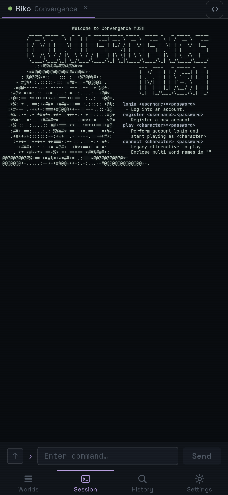
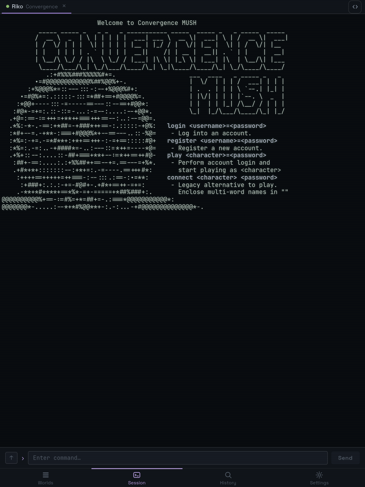
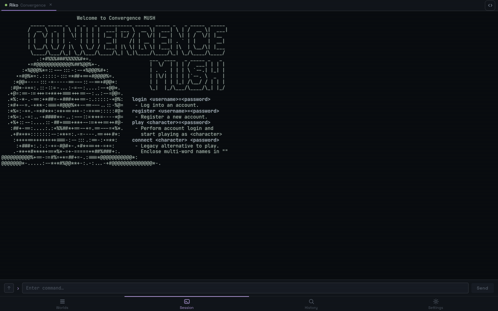

<div align="center">


# SharpClient

**A modern, cross-platform client for MUSH &amp; MUD text worlds.**

[](https://github.com/SharpMUSH/SharpClient/actions/workflows/ci.yml)
[](https://github.com/SharpMUSH/SharpClient/releases)
[](https://dotnet.microsoft.com)
[](#install)
[](LICENSE)

</div>

SharpClient connects to text-based **MUSH / MUD** servers over Telnet, with the modern MU\* protocol
stack and a clean Blazor interface. A single, fully-testable core drives both a native **Android** app
and a **Blazor web** client, speaking Telnet through
[TelnetNegotiationCore](https://github.com/HarryCordewener/TelnetNegotiationCore).

## Features

- **Modern MU\* protocols** — GMCP, MSSP, MSDP, NAWS and CHARSET, plus MXP and Pueblo, with
  EOR/GA prompt handling and UTF-8.
- **Rich rendering** — full ANSI/SGR colour &amp; styling, MXP links, and MXP/Pueblo markup.
- **Automation** — per-world and per-character **triggers** and **aliases**.
- **Sessions that stay put** — multiple worlds &amp; characters, saved connect credentials, and
  automatic **reconnect with backoff**.
- **Truly cross-platform** — one shared core behind a MAUI Blazor Hybrid Android app and a
  Blazor Server web client.
- **Built to be tested** — all connection, parsing and automation logic lives in a MAUI-free core
  with a TUnit suite.

## Screenshots

<table>
  <tr>
    <td align="center" width="33%"><br /><sub><b>Mobile</b></sub></td>
    <td align="center" width="33%"><br /><sub><b>Tablet</b></sub></td>
    <td align="center" width="33%"><br /><sub><b>Web</b></sub></td>
  </tr>
</table>

## Install

### Android

Signed APKs are attached to every [release](https://github.com/SharpMUSH/SharpClient/releases). You can
sideload the `.apk` directly, but the easiest way to install **and stay updated** is
[Obtainium](https://github.com/ImranR98/Obtainium), which tracks this repo's releases for you:

1. Install Obtainium.
2. Add an app with this source URL:
   ```
   https://github.com/SharpMUSH/SharpClient
   ```
   or, on your phone, paste this deep link (GitHub can't render it as a clickable link, so copy it as-is):
   ```
   obtainium://add/https://github.com/SharpMUSH/SharpClient
   ```
3. Obtainium picks up the universal signed APK from each release and notifies you when a new version ships.

Each release ships a **single universal APK** — no ABI/architecture filter needed — and its
`versionName`/`versionCode` are derived from the release tag, so Obtainium and Android both see the
correct version and can update in place. If a release is marked **pre-release** on GitHub, enable
"include prereleases" for the app in Obtainium or it will be skipped.

### Web

```sh
dotnet run --project src/SharpClient.Web
```

Then open the printed URL (default <http://localhost:5220>).

## Build from source

The day-to-day loop needs no Android SDK — it runs on the `Core`, `Data` and `UI` projects and the test suites:

```sh
dotnet build SharpClient.slnx                 # solution (skips the App head if it can't build)
dotnet run --project tests/SharpClient.Tests   # run the TUnit suite
```

### Android app head

```sh
dotnet build src/SharpClient.App/SharpClient.App.csproj -f net10.0-android
```

Building `SharpClient.App` requires the `maui-android` workload plus the Android SDK and **JDK 17**
(the .NET for Android toolchain rejects newer JDKs). Machine-specific SDK/JDK paths are wired in via a
gitignored `Directory.Local.props`. On a fresh machine:

```sh
# Install the Android SDK (accepts licenses, downloads platform-tools/build-tools/platform)
dotnet build src/SharpClient.App/SharpClient.App.csproj -f net10.0-android \
  -t:InstallAndroidDependencies -p:AcceptAndroidSdkLicenses=True \
  -p:AndroidSdkDirectory=$HOME/Android/Sdk -p:JavaSdkDirectory=<jdk-17-path>

# Then point Directory.Local.props at your AndroidSdkDirectory and JavaSdkDirectory.
```

MAUI has no Linux desktop head, so on Linux the App head builds/deploys to an Android device or
emulator while the inner loop stays on `Core` + `Tests`.

## Architecture

A MAUI-free core holds all the logic; the platform heads are thin hosts around it.

| Project | Kind | Responsibility |
|---------|------|----------------|
| `src/SharpClient.Core` | class library (`net10.0`) | The engine: telnet connection, ANSI/MXP parsing, triggers &amp; aliases, world/character model, sessions. Runs on plain .NET. |
| `src/SharpClient.Data` | class library (`net10.0`) | Persistence — worlds, characters and session history (EF Core / SQLite). |
| `src/SharpClient.UI` | Razor class library (`net10.0`) | Shared Blazor UI components. |
| `src/SharpClient.App` | MAUI Blazor Hybrid (`net10.0-android`) | Android app head — hosts the UI, provides platform services, wires DI. |
| `src/SharpClient.Web` | Blazor Server (`net10.0`) | Web client head. |
| `tests/*` | TUnit / bUnit | Unit tests for `Core` &amp; `Data`, component tests for `UI`. |

Shared build settings (warnings-as-errors, nullable, modern C#) live in
[`Directory.Build.props`](Directory.Build.props); the SDK is pinned to .NET 10 via
[`global.json`](global.json). The design spec and visual-design brief live in
[`docs/superpowers/specs`](docs/superpowers/specs).

## Tech stack

.NET 10 · MAUI Blazor Hybrid · Blazor Server · TUnit &amp; bUnit · EF Core (SQLite) ·
[TelnetNegotiationCore](https://github.com/HarryCordewener/TelnetNegotiationCore)

## Contributing

Issues and pull requests are welcome. The inner loop runs entirely on `Core` + `Tests` (no Android
SDK required) — see [Build from source](#build-from-source). CI builds and runs the test suites on
every push.

## License

Licensed under the [Apache License 2.0](LICENSE).

## Acknowledgements

- [TelnetNegotiationCore](https://github.com/HarryCordewener/TelnetNegotiationCore) — the Telnet / MU\* protocol engine.
- Part of the [SharpMUSH](https://github.com/SharpMUSH) project.
